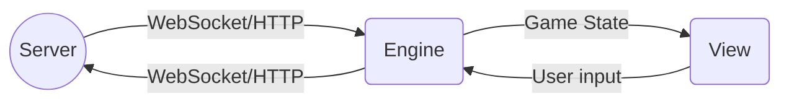

# Архитектура мобильного приложения "Party Buddy"

## Используемые технологии
Приложение будет разрабатываться на языке `Dart` с использованием фреймворка `Flutter`:
- `dart-sdk 3.1.4` (https://dart.dev/get-dart)
- `flutter 3.13.18` (https://docs.flutter.dev/get-started/install)

## Общая схема взаимодействия
В ходе игрового процесса приложение должно поддерживать коммуникацию с сервером и отражать актуальное состояние игры на экране.
Для этого необходимо ввести многопоточное взаимодействие, в языке `dart` потоки представлены `изолятами`, которые не имеют общей памяти, взаимодействие друг с другом они производят по специальным каналам связи.
- **View** изолят (также **Main**) будет отвечать за отображение всех виджетов, взаимодействие с вводом пользователя. Он также будет общаться с сервером в рамках `HTTP` запросов.
- **Engine** изолят будет поддерживать `WebSocket`-соединение с сервером, обмениваться с ним сообщениями в рамках ранее описанного протокола. В то же время он будет передавать актуальное состояние игры в `Main` и получать из него информацию о вводе пользователя.

Схематично это выражается так (относится только к ходу игры):

>Например, в момент начала голосования **Engine** изолят получит сообщение об этом от сервера, сформирует объект `Voting`, содержащий в себе всю необходимую для визуализации информацию (ответы и их авторы), и направит во **View**. Последний отобразит соответсвующий экран голосования, получит выбор пользователя и направит его в **Engine**, который перенаправит это к серверу.

## Data, Domain, Presentation
Код приложения предлагается разделить на 3 логических уровня:
- `Presentation` - имплементация страниц, виджетов, контроллеров состояний.
- `Domain` - набор сущностей (таких как `Game`, `Task`), описание бизнес-логики игры, интерфейсов репозиториев (которые будут предоставлять данные). Чистый `dart`.
- `Data` - имплементация репозиториев, взаимодействие с API, коммуникация с сервером по `WebSocket`.

## Presentation

В качестве экранов необходимо будет реализовать:
- `MainMenuScreen`;
- `GameListScreen`;
- `GameInfoScreen`;
- `TaskListScreen`;
- `TaskInfoScreen`;
- `GameStartScreen`;
- `GameJoinScreen`;
- `WaitingRoomScreen`;
- `TaskScreen`;
- `VotingScreen`;
- `VotingResultsScreen`;
- `GameResultsScreen`;
- `ConstructorScreen`;
- `TaskCreateScreen`;
- `GameCreateScreen`.

>Содержание экранов отображено в требованиях и заготовленных макетах.

Виджеты общего назначения, которые потребуются для взаимодействия с пользователем:
- `ShortInputLabel`;
- `LongInputLabel`;
- `SelectableList`;
- `Button`;
- `Slider`;
- `ImageView`.

Дополнительные виджеты:
- `GameHeader`;
- `TaskHeader`;
- `OptionPicker` (для выбора ответа из списка);
- `OptionSwitcher` (для переключения в каталоге);
- `CheckBoxLabel`.

За основу стилистики берется `Material Design` (https://m3.material.io/).
## Domain

В качестве основных сущностей здесь будут представлены:
- `User`. Будет иметь никнейм и опционально `photo url`.
- `Game`. Атрибуты описаны в протоколе клиент-серверного взаимодействия.
- `Task`.  -- || --
- `Voting` Будет содержать список ответов и их авторов.

Здесь же предстоит реализовать `Engine`, который будет осуществлять прохождение заданий игры.
## Data

Здесь будет полностью описано все виды взаимодействия  приложения с данными:
- `HTTP` запросы к серверу;
- `WebSocket` коммуникация с сервером;
- `LocalStorage` имплементация локального хранилища, куда можно будет помещать созданные пользователем игры, никнейм и т.д.  
   >Предполагается сделать это с помощью пакета `localstorage`.
